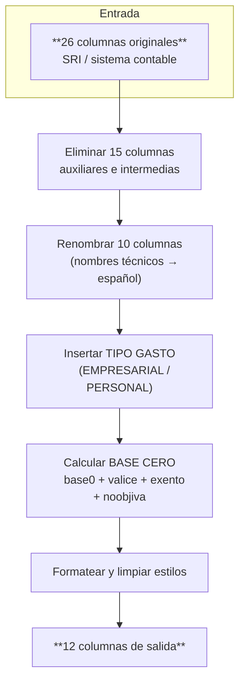

# InvoiceFlow

**InvoiceFlow** es una herramienta de terminal y cliente web que transforma archivos de facturación electrónica ecuatoriana en formato Excel, reduciendo 26 columnas a 12 columnas estructuradas listas para análisis contable. Soporta archivos `.xls` y `.xlsx`, y ofrece dos interfaces: CLI interactiva y cliente web con arrastre de archivos.

## Características

- **26 columnas → 12 columnas**: eliminación de columnas auxiliares, renombrado semántico, cálculo automático de BASE CERO
- **Dos interfaces**: CLI interactiva (terminal) y cliente web (navegador)
- **Archivos `.xls` y `.xlsx`**: los archivos `.xls` se convierten internamente a `.xlsx`
- **Modo interactivo**: selector de archivos con `@`, comando `/web` para iniciar el cliente web
- **Formato profesional de salida**: encabezados en negrita, filtros automáticos, paneles congelados, anchos dinámicos, formato monetario y de fechas
- **API REST**: el cliente web se comunica con endpoints Express para subir, procesar y descargar archivos

## Instalación

### Requisitos previos

- **Node.js**: v18.0.0 o superior
- **npm**: v9.0.0 o superior

### Instalación global

```bash
npm install -g invoiceflow-cli
```

### Instalación local (desarrollo)

```bash
git clone <repo-url>
npm install
npm run build
```

### Verificación

```bash
invo --version
# InvoiceFlow version 1.0.3
```

## Uso

### CLI — Modo interactivo

Sin argumentos, `invo` inicia el modo interactivo con un banner ASCII y提示：

```bash
invo
```

```
╔════════════════════════════════════════════════════════════╗
║   ██╗███╗   ██╗██╗   ██╗ ██████╗ ██╗ ██████╗███████╗       ║
║   ██║████╗  ██║██║   ██║██╔═══██╗██║██╔════╝██╔════╝       ║
║   ██║██╔██╗ ██║██║   ██║██║   ██║██║██║     █████╗         ║
║   ██║██║╚██╗██║╚██╗ ██╔╝██║   ██║██║██║     ██╔══╝         ║
║   ██║██║ ╚████║ ╚████╔╝ ╚██████╔╝██║╚██████╗███████╗       ║
║   ╚═╝╚═╝  ╚═══╝  ╚═══╝   ╚═════╝ ╚═╝ ╚═════╝╚══════╝       ║
║                       InvoiceFlow                          ║
╚════════════════════════════════════════════════════════════╝

Escribe @ para seleccionar archivos Excel

  @            Buscar archivos
  @ruta        Abrir archivo específico
  /web         Iniciar cliente web
  /quit        Salir
> _
```

#### Selector `@`

Escribe `@` en el prompt para abrir el selector interactivo de archivos Excel en el directorio actual. Selecciona archivos con la barra espaciadora y confirma con Enter. También puedes escribir `@ruta` para abrir un archivo específico directamente.

Si eliminas el `@` con Backspace o Delete, el selector se cierra automáticamente.

#### Comandos

| Comando | Descripción |
|---------|-------------|
| `@` | Abrir selector de archivos Excel |
| `@ruta` | Abrir archivo por ruta específica |
| `/web` | Iniciar el cliente web en `http://localhost:3000` |
| `/quit` | Salir de la CLI |

#### Flujo de procesamiento (modo interactivo)

1. Escribe `@` para seleccionar archivos, o escribe la ruta de un archivo directamente
2. Presiona Enter para confirmar
3. Selecciona el **Tipo de gasto** (`EMPRESARIAL` o `PERSONAL`) cuando se solicite
4. Ingresa el **nombre del archivo de salida** (se sugiere automáticamente)
5. Los archivos se procesan y el resultado se guarda en el mismo directorio

### CLI — Modo argumentos

Pasa archivos directamente como argumentos. **Siempre se solicita el tipo de gasto y el nombre de salida**, sin importar el modo.

```bash
invo facturas.xlsx
invo enero.xlsx febrero.xlsx marzo.xlsx
invo --tipo-gasto PERSONAL reportes.xlsx
```

#### Opciones

| Opción | Descripción |
|--------|-------------|
| `--tipo-gasto <valor>` | Valor para la columna `TIPO GASTO`: `EMPRESARIAL` (default) o `PERSONAL` |
| `-V, --version` | Mostrar versión |
| `-h, --help` | Mostrar ayuda |

#### Ejemplos

```bash
# Procesar un archivo (siempre solicita tipo de gasto y nombre de salida)
invo facturas.xlsx

# Especificar tipo de gasto
invo --tipo-gasto PERSONAL gastos_mensuales.xlsx

# Procesar múltiples archivos (solicita salida para cada uno)
invo enero.xlsx febrero.xlsx marzo.xlsx

# Usar ruta específica
invo ./carpeta/facturas_junio.xls
```

### Cliente web

El cliente web permite procesar archivos desde el navegador con una interfaz visual.

#### Iniciar

```bash
# Desde la CLI interactiva
invo
> /web

# Directamente (después de npm run build)
npm run start:web
```

Accede a `http://localhost:3000`.

#### Funcionalidades

- **Arrastre de archivos**: arrastrar y soltar o seleccionar archivos `.xls` / `.xlsx` (hasta 20 archivos)
- **Selector de tipo de gasto**: elegir `EMPRESARIAL` o `PERSONAL` antes de procesar
- **Nombre de salida personalizado**: cada archivo puede tener un nombre de salida diferente
- **Procesar todos**: un clic para procesar todos los archivos subidos
- **Descarga individual**: cada archivo procesado se puede descargar por separado
- **Descarga masiva**: un clic para descargar todos los resultados como archivos separados
- **Estado vacío**: pantalla de inicio cuando no hay archivos

## Arquitectura

### CLI — Flujo de datos

```mermaid
flowchart TD
    A["`invo <archivo>`"] --> B{"¿Modo interactivo?"}
    B -->|Sí| C["`@` selector → selecciona archivos"]
    B -->|No| D["Archivos pasados como argumentos"]
    C --> E["Prompt: Tipo de gasto"]
    D --> E
    E --> F["Prompt: Nombre de salida"]
    F --> G["ExcelTransformer.transform"]
    G --> H["Lectura: .xls → .xlsx si es necesario"]
    H --> I["Eliminación de 15 columnas"]
    I --> J["Renombrado de 10 columnas"]
    J --> K["Inserción: TIPO GASTO"]
    K --> L["Cálculo: BASE CERO"]
    L --> M["Formateo de salida"]
    M --> N["Archivo .xlsx en directorio de entrada"]
```

### Cliente web — Arquitectura

```mermaid
flowchart LR
    A["`**Cliente Web**
    React + Zustand
    http://localhost:3000"] --> B["`**Express API**
    POST /api/files
    GET /api/files
    DELETE /api/files/:id
    POST /api/files/process
    GET /api/files/:id/download"]
    B --> C["`**Procesador**
    ExcelTransformer
    Same engine as CLI"]
    C --> D["`**Store (memoria)**
    FileJob[]
    tempPaths"]
```

### Flujo de transformación



## Flujo de procesamiento

El motor de transformación procesa cada archivo en 8 pasos:

```
1. Lectura          → ExcelJS lee el archivo; .xls se convierte a .xlsx con SheetJS
2. Detección        → Identifica columnas por nombre técnico (fila 1) y color
3. Eliminación      → Remueve 15 columnas: tpcomproba, numautori, fecautori, placa,
                      nro_item, codprincipal, codauxiliar, cantidad, precio_u,
                      descuento, poriva, base0, valice, exento, noobjiva
4. Renombrado       → Reemplaza 10 nombres técnicos por nombres legibles
5. Inserción        → Inserta TIPO GASTO (configurable) después de DESCRIPCIÓN
6. Cálculo          → Suma base0 + valice + exento + noobjiva → BASE CERO
7. Formateo         → Negrita en encabezados, autofiltro, freeze pane, anchos dinámicos
8. Limpieza         → Elimina estilos residuales y formatos condicionales
```

### Columnas eliminadas (15)

| Columna técnica | Descripción |
|-----------------|-------------|
| `tpcomproba` | Tipo de comprobante |
| `numautori` | Número de autorización SRI |
| `fecautori` | Fecha de autorización SRI |
| `placa` | Placa vehicular |
| `nro_item` | Número de ítem |
| `codprincipal` | Código principal del producto |
| `codauxiliar` | Código auxiliar del producto |
| `cantidad` | Cantidad |
| `precio_u` | Precio unitario |
| `descuento` | Descuento |
| `poriva` | Porcentaje IVA (siempre 15%) |
| `base0` | Base tarifa 0% (usada en cálculo, luego eliminada) |
| `valice` | Valor ICE (usado en cálculo, luego eliminado) |
| `exento` | Exento de IVA (usado en cálculo, luego eliminado) |
| `noobjiva` | No objeto de IVA (usado en cálculo, luego eliminado) |

### Columnas renombradas (10)

| Nombre original | Nombre de salida |
|-----------------|------------------|
| `idrecep` | `ID RECEPTOR` |
| `secuenciales` | `SECUENCIAL ` |
| `ruc_emisor` | `RUC EMISOR` |
| `razonsocial` | `RAZÓN SOCIAL` |
| `fechaemi` | `FECHA EMISIÓN` |
| `claveacceso` | `CLAVE ACCESO` |
| `descripcion` | `DESCRIPCIÓN` |
| `baseimp` | `BASE  IVA` |
| `valiva` | `IVA` |
| `precio_t` | `TOTAL` |

### Columnas calculadas (1)

| Columna | Fórmula | Descripción |
|---------|---------|-------------|
| `BASE CERO` | `base0 + valice + exento + noobjiva` | Suma de las columnas de tarifa 0%. Se posiciona antes de `BASE  IVA`. |

### Columna insertada (1)

| Columna | Valor por defecto | Descripción |
|---------|-------------------|-------------|
| `TIPO GASTO` | `EMPRESARIAL` | Insertada después de `DESCRIPCIÓN`. Configurable con `--tipo-gasto` o desde el selector interactivo. |

### Resumen: 12 columnas de salida

| # | Columna | Origen |
|---|---------|--------|
| 1 | `ID RECEPTOR` | Renombrada de `idrecep` |
| 2 | `SECUENCIAL ` | Renombrada de `secuenciales` |
| 3 | `RUC EMISOR` | Renombrada de `ruc_emisor` |
| 4 | `RAZÓN SOCIAL` | Renombrada de `razonsocial` |
| 5 | `FECHA EMISIÓN` | Renombrada de `fechaemi` |
| 6 | `CLAVE ACCESO` | Renombrada de `claveacceso` |
| 7 | `DESCRIPCIÓN` | Renombrada de `descripcion` |
| 8 | `TIPO GASTO` | Insertada (default: `EMPRESARIAL`) |
| 9 | `BASE CERO` | Calculada: `base0 + valice + exento + noobjiva` |
| 10 | `BASE  IVA` | Renombrada de `baseimp` |
| 11 | `IVA` | Renombrada de `valiva` |
| 12 | `TOTAL` | Renombrada de `precio_t` |

### Formato del archivo de salida

- **Encabezados**: Arial 12, negrita, centrados, con ajuste de línea
- **Filtros automáticos**: habilitados en todas las columnas
- **Paneles congelados**: fila de encabezado fija (freeze pane en fila 2)
- **Ancho de columna**: calculado dinámicamente (mín. 8, máx. 50 / 80 para texto)
- **Formato numérico**: columnas monetarias con formato `#,##0.00`
- **Formato de fechas**: columna FECHA EMISIÓN con formato `mm-dd-yy`
- **Estilos limpios**: sin colores residuales, formatos condicionales ni metadatos

## Estructura del proyecto

```
invoiceflow-cli/
├── src/
│   ├── index.ts                 # Punto de entrada (ejecuta run() desde cli.ts)
│   ├── cli.ts                   # Lógica CLI: prompts interactivos, selector @,
│   │                           #   procesamiento, comando /web, progress bar
│   ├── transformer.ts          # Motor de transformación Excel (ExcelJS).
│   │                           #   Define SEMANTIC_RULES, formateo de salida,
│   │                           #   y limpieza post-guardado.
│   ├── core/
│   │   ├── types.ts            # Tipos compartidos (TransformOptions, etc.)
│   │   └── processor.ts        # Orquestador de procesamiento (processFile,
│   │                           #   processFiles, genera IDs únicos)
│   ├── server/
│   │   ├── index.ts            # Servidor Express (inicia en puerto 3000)
│   │   ├── store.ts            # Almacén en memoria: Map de FileJob, tempPaths
│   │   └── routes/
│   │       └── files.ts        # Rutas API: upload, list, delete, process, download
│   ├── web/
│   │   ├── index.html          # HTML de entrada (Vite)
│   │   ├── main.tsx            # Montaje React
│   │   ├── App.tsx             # Componente raíz
│   │   ├── index.css           # Estilos (Geist font, fondo #f5f5f7)
│   │   ├── api.ts              # Cliente HTTP (fetch al backend)
│   │   ├── store.ts            # Estado global Zustand (files, tipoGasto,
│   │   │                       #   outputNames, isProcessing, isUploading)
│   │   └── components/
│   │       ├── Header.tsx      # Barra de navegación superior
│   │       ├── FileZone.tsx    # Zona de arrastre para subir archivos
│   │       ├── TipoGastoSelect.tsx  # Selector EMPRESARIAL / PERSONAL
│   │       ├── FileCard.tsx    # Tarjeta por archivo (nombre, estado, acciones)
│   │       ├── ProcessButton.tsx    # Botón "Procesar todos"
│   │       └── ResultPanel.tsx      # Panel de resultados y descargas
│   └── utils/
│       ├── colors.ts           # Clasificador de colores (azul, verde, rojo,
│       │                       #   amarillo, morado, ninguno)
│       ├── formulas.ts         # Traducción de fórmulas a nuevas posiciones
│       ├── gradient.ts         # Utilidades de gradiente
│       └── paths.ts            # Validación de rutas de archivo
├── dist/                        # Código JavaScript compilado ( TypeScript)
├── vite.config.ts               # Configuración Vite para build web
├── tsconfig.json
└── package.json
```

## API REST

El servidor Express expone los siguientes endpoints cuando se inicia el cliente web:

| Método | Ruta | Descripción |
|--------|------|-------------|
| `POST` | `/api/files` | Subir archivos (multipart/form-data, hasta 20 archivos, 50 MB c/u). Acepta `tipoGasto` en el body. |
| `GET` | `/api/files` | Listar todos los archivos subidos con su estado (`pending`, `processing`, `done`, `error`). |
| `GET` | `/api/files/:id` | Obtener detalle de un archivo específico. |
| `DELETE` | `/api/files/:id` | Eliminar un archivo y su archivo temporal del disco. |
| `POST` | `/api/files/process` | Procesar todos los archivos con estado `pending`. Body: `{ tipoGasto, outputNames }`. |
| `GET` | `/api/files/:id/download` | Descargar el archivo procesado. Devuelve el `.xlsx` con el nombre de salida configurado. |

### Estados de un archivo

| Estado | Descripción |
|--------|-------------|
| `pending` | Archivo subido, a la espera de procesamiento |
| `processing` | Actualmente siendo transformado |
| `done` | Procesado correctamente, listo para descarga |
| `error` | Falló durante la transformación |

## Configuración y scripts

### Scripts disponibles

| Comando | Descripción |
|---------|-------------|
| `npm run build` | Compilar TypeScript (CLI + servidor) y hacer ejecutable `dist/index.js` |
| `npm run build:web` | Compilar cliente web con Vite (salida en `src/web/dist`) |
| `npm run build:all` | Compilar todo (CLI + servidor + web) |
| `npm run dev:web` | Desarrollo web con hot reload (Vite) |
| `npm run start:web` | Iniciar servidor web en producción (después de `npm run build:all`) |
| `npm run clean` | Eliminar `dist/` y `src/web/dist` |
| `npm run rebuild` | Limpiar y recompilar todo |

### Instalación como comando global

Después de `npm install -g invoiceflow-cli`, el comando `invo` queda disponible globalmente en la terminal.

## Desarrollo

### Setup local

```bash
git clone <repo-url>
npm install
npm run build
```

### Ejecución durante desarrollo

```bash
# CLI con ts-node (sin compilar)
npm start

# Cliente web con hot reload
npm run dev:web

# Compilar cambios en CLI/servidor
npm run build
```

### Build para producción

```bash
npm run build:all
npm run start:web   # Inicia en http://localhost:3000
```

### Tests

```bash
npm test
# echo "Error: no test specified" && exit 1
```

> Los tests no están configurados aún. Contribuidores animados a añadirlos.

## Solución de problemas

### "El archivo no se procesa / archivo corrupto"

Los archivos `.xls` (Excel 97-2003) se convierten internamente a `.xlsx`. Si la conversión falla:
1. Abre el archivo en Excel y guárdalo nuevamente como `.xlsx`
2. Verifica que el archivo no esté protegido con contraseña

### "Error: Solo se permiten archivos .xlsx o .xls"

El cliente web solo acepta archivos con extensión `.xlsx` o `.xls`. Verifica que el archivo sea un Excel válido y no un CSV u otro formato.

### "No se encontraron archivos Excel"

En modo interactivo, `@` solo busca archivos `.xlsx` y `.xls` en el directorio actual (no en subdirectórios, excepto `node_modules`, `.git` y `dist`).

### "Error de permiso" al guardar

El archivo de salida se guarda en el mismo directorio del archivo de entrada. Verifica que tengas permisos de escritura en esa carpeta.

### "El navegador no se abre automáticamente" (comando `/web`)

El comando `/web` intenta abrir el navegador según la plataforma (`open` en macOS, `start` en Windows, `xdg-open` en Linux). Si falla, abre manualmente `http://localhost:3000`.

### "Archivo demasiado grande"

El cliente web limita cada archivo a 50 MB. Para archivos mayores, usa la CLI directamente.

### El archivo de salida tiene estilos o colores inesperados

InvoiceFlow limpia estilos residuales del archivo de entrada, pero algunos formatos muy complejos (hojas protegidas, macros) pueden generar conflictos. Intenta guardar el archivo de entrada como `.xlsx` limpio antes de procesarlo.

## Roadmap

- [ ] **Tests automatizados** — Cobertura de transformación, API y componentes web
- [ ] **Modo batch** — Procesar carpetas completas con patrón de archivos
- [ ] **Historial de procesamiento** — Guardar registro de archivos transformados
- [ ] **CLI pipe** — Encadenar transformaciones con `|` entre comandos
- [ ] **Exportación CSV** — Soporte para exportar a CSV además de `.xlsx`
- [ ] **Multi-idioma** — Soporte para inglés además de español
- [ ] **Configuración persistida** — Guardar preferencia de `tipo-gasto` default
- [ ] **Progreso en web** — Barra de progreso visual durante el procesamiento

## Licencia

ISC